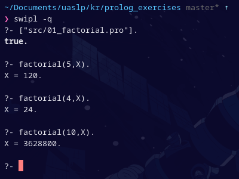
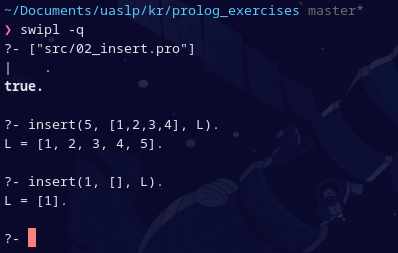
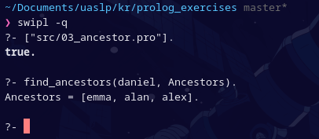
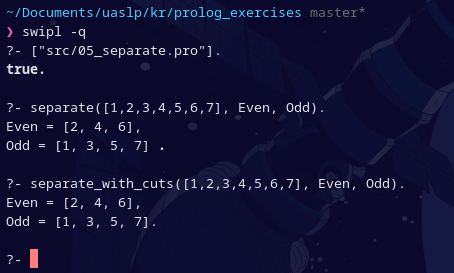
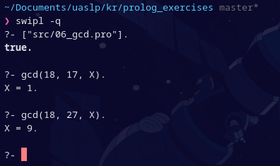
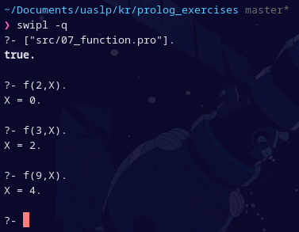

# Ejercicios de Prolog

Lista de ejercicios de la materia *Representación Del Conocimiento Y Ontologías*.

Se utiliza el interprete [**SWI-Prolog**](https://www.swi-prolog.org/).

## Lista de ejercios

1. Corregir el siguiente programa para que valide si recibe un número negativo

    `src/01_factorial.pro`

    ```prolog
    factorial(0,1):-!.
    factorial(N,R):-
        N>0,!,
        N1 is N-1, 
        factorial(N1,R1), 
        R is N*R1.
    ```

    

2. Hacer un predicado que inserte un elemento al final de una lista
   
    ```prolog
    insert(X, [], [X]):-!.
    insert(X, [H|T], [H|R]):-
        insert(X, T, R).
    ```

    

3. Hacer un predicado que encuentre a todos los antepasados de una persona: tu papá, tu mamá y los padres de ellos son tus antepasados y todos los que le sigan en el árbol

    ```prolog
    parent_of(Child, Parent):-
        mother_of(Child, Parent);
        father_of(Child, Parent).
        
    ancestor_of(Decendant, Ancestor):-
        parent_of(Decendant, Ancestor);
        parent_of(Possible_ancestor, Ancestor),
        ancestor_of(Decendant, Possible_ancestor).

    find_ancestors(Decendant, Ancestors):-
        findall(Ancestor, ancestor_of(Decendant, Ancestor), Ancestors).

    mother_of(daniel, emma).
    father_of(emma, alex).
    father_of(daniel, alan).
    ```

    

4. Hacer un predicado abuelo considerando tanto el de mamá como el de papá

    ```prolog
    parent_of(X,Y):-
        mother_of(X,Y);
        father_of(X,Y).

    grandfather_of(X,Z)-:
        parent_of(Y,Z),
        father_of(X,Y).
    ```

5.  Escribe, con y sin cortes, el procedimiento “separa”, que divide una lista en dos sublistas, la primera con los números positivos, y la segunda con los números negativos.
  
    ```prolog
    separate([], [], []).
    separate([H|T], [H|Even], Odd) :-
        0 is H mod 2,
        separate(T, Even, Odd).
    separate([H|T], Even, [H|Odd]) :-
        1 is H mod 2,
        separate(T, Even, Odd).

    separate_with_cuts([], [], []) :- !.
    separate_with_cuts([H|T], [H|Even], Odd) :-
        0 is H mod 2,!,
        separate_with_cuts(T, Even, Odd).
    separate_with_cuts([H|T], Even, [H|Odd]) :-
        1 is H mod 2,
        separate_with_cuts(T, Even, Odd).
    ```


    

6. Hacer un predicado para obtener el máximo común divisor entre dos números

    ```prolog
    gcd(X, 0, Z):-
        Z is abs(X), !.
    gcd(X, Y, Z):-
        abs(Y) > 0,!,
        X1 is X mod Y,
        gcd(Y, X1, Z).
    ```

    

7. Escribir un predicado para una función que devuelva 0 si x es menor que 3, 2 si es mayor o igual a 3 y menor que 6 y 4 si x es menor o igual a 6

    ```prolog
    f(X,Y):-
        X < 3,
        Y is 0,!.
    f(X,Y):-
        X < 6,
        Y is 2,!.
    f(_,Y):-
        Y is 4,!.
    ```

    


8. Hacer un predicado para Concatenar dos listas

    ```prolog
    concatenate([],L,L):-!.
    concatenate([H|T],L2,[H|L]):-
        concatenate(T,L2,L).
    ```

9. Hacer un predicado para invertir los elementos de una lista

    ```prolog
    invertir(L1, L2).
    ```

10. Hacer un predicado que obtenga la longitud de la lista (usar cortes)

    ```prolog
    longitud(L,X).
    ```

11. Hacer un programa usando listas que sume los elementos de las 2 listas de números enteros dejando el resultado en otra lista
    
    ```prolog
    suma_elem(L1, L2, SL).
    ```

12. Hacer un predicado usando listas que regrese el último elemento de una lista
    
    ```prolog
    ultimo_elem(L, X). 
    ```

13. Usando listas, programar con un predicado el algoritmo de QuickSort

    ```prolog
    quicksort(L, SL).
    ```

14. Hacer un predicado usando cortes para la función de Fibonacci
    
    ```prolog
    fibonacci(N, F).
    ```

15. Hacer un predicado para eliminar los N primeros elementos de una lista y regresar el resto

    ```prolog
    sac_n_pri(L,N,R). 
    ```